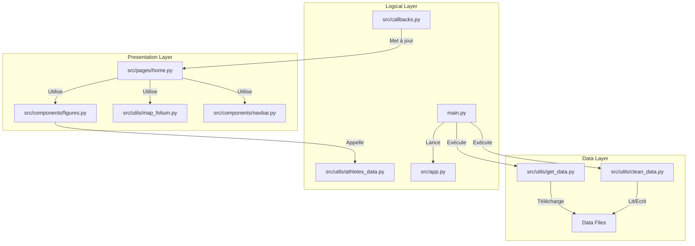

# Dashboard Jeux Olympiques 🏅

Dashboard interactif pour l'analyse des données historiques des Jeux Olympiques d'été. Ce projet permet d'explorer la répartition des médailles par pays, la géolocalisation des performances et les statistiques individuelles des athlètes.


## 📖 User Guide

Instructions pour déployer et utiliser le dashboard sur votre machine.

### Pré-requis
*   Python 3.8 ou supérieur
*   Git
*   Un compte Kaggle et une clé API `kaggle.json` (optionnel si les données sont déjà présentes)

### Installation

1.  **Cloner le dépôt**
    ```bash
    git clone https://github.com/jeevanramakichenin/PythonProject.git
    cd PythonProject
    ```

2.  **Installer les dépendances**
    ```bash
    python -m pip install -r requirements.txt
    ```

3.  **Configuration des données**
    *   Placez votre fichier `kaggle.json` à la racine du projet pour le téléchargement automatique.
    *   *Ou* assurez-vous que `data/cleaned/cleaned_data.csv` est présent.

### Lancement

Exécutez la commande suivante à la racine du projet :

```bash
python main.py
```

Le dashboard sera accessible dans votre navigateur à l'adresse : `http://localhost:8050/`

---

## 💾 Data

Ce projet utilise des données Open Data publiques.

*   **Source** : [Kaggle - Olympic Games](https://www.kaggle.com/datasets/the-guardian/olympic-games) (The Guardian)
*   **Fichier principal** : `summer.csv` (Jeux Olympiques d'été de 1896 à 2012)
*   **Volume** : > 30 000 médailles (Observations > 100).
*   **Traitement** : 
    *   Nettoyage des données manquantes (pays).
    *   Calcul d'un score pondéré (Or=3, Argent=2, Bronze=1).
    *   Les données sont téléchargées via `src/utils/get_data.py` et nettoyées via `src/utils/clean_data.py`.

---

## 🛠 Developer Guide

### Architecture du Code

Le projet suit une architecture modulaire basée sur le framework **Dash**.

*   **Programmation Impérative** : Le flux principal est contrôlé par `main.py` qui orchestre le chargement des données et lance le serveur.
*   **Pattern MVC (simplifié)** : 
    *   **Model** (Données) : Géré par `src/utils` (pandas).
    *   **View** (Interface) : Définie dans `src/pages` et `src/components`.
    *   **Controller** (Logique) : Géré par `src/callbacks.py`.

### Diagramme d'Architecture (Mermaid)



### Ajouter une nouvelle page
1. Créer un fichier `src/pages/ma_nouvelle_page.py`.
2. Définir une variable `layout`.
3. Importer et ajouter la route dans `main.py` (fonction `display_page`).

---

## 📊 Rapport d'analyse

Les principales conclusions tirées de l'analyse des données :

1.  **Hégémonie historique** : L'analyse du Top 10 révèle une domination nette de certaines nations (ex: USA) sur le cumul des médailles d'été.
2.  **Concentration des performances** : L'histogramme des athlètes montre une distribution de Pareto : une immense majorité d'athlètes n'a qu'une ou deux médailles, tandis qu'une infime élite (comme Michael Phelps) cumule un nombre exceptionnel de podiums.
3.  **Géographie du sport** : La carte choroplèthe met en évidence les disparités Nord/Sud dans l'accès aux podiums olympiques.

---

## © Copyright

Je déclare sur l’honneur que le code fourni a été produit par moi/nous même, à l’exception des lignes ci dessous.

*   `src/utils/map_folium.py` : Utilisation de la librairie Folium inspirée de la documentation officielle (https://python-visualization.github.io/folium/).
*   Structure CSS/Bootstrap : Inspirée des exemples de `dash-bootstrap-components`.

Toute ligne non déclarée ci dessus est réputée être produite par l’auteur (ou les auteurs) du projet.